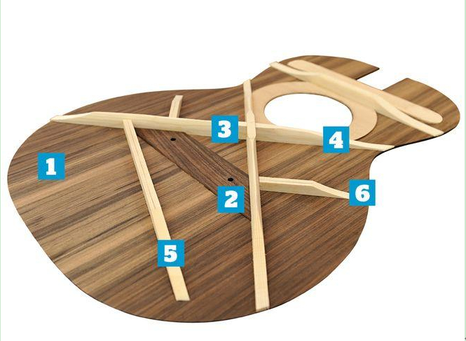

# Structure
## how to check the status of a guitar
* body
    * crack
      * back (backboard)
      * front (soundboard)
      * side
      * seam
          * bridge and soundboard
          * neck and body
    * even surface ?
         * swell
            * the swell between two beams 4 & 6 is normal
                * 
         * curve of soundboard is normal
         * dent
            * sound hole part
            * neck be higher or lower
                * how to check
                    * put a ruler on the guitar-fret and check if the ruler align with ridge. If the the ruler is a little bit lower, it is okay.
            * increase action height
* bridge
    * action height
        * play scale to feel the action height
        * check height of saddle
            * if the height of saddle is good enough, you can have a change to adjust action
            * if the height of saddle is to low you will get over-smooth break-angle
            * 2 - 4 millimeters is good
                * 2.5 - 3.5 is proper
            * too heigh -> create dent around sound-hole
    * bridge
        * saddle
            * oblique
                * Position of sixth string should be higher then the position of first string, since the diameter of sixth string is larger then rest of strings
            * if height of 12th fret is 2mm, then the height of saddle should be higher then bridge to 4mm
        * seam between bridge and soundboard
* neck
    * check if neck is properly joint at the body
        * put a long ruler in the middle of neck
            * between third and fourth string
            * if the end (point to saddle) of the ruler just fit on the surface of bridge or a bit lower, the neck is properly attached on body
        * if it is not proper (usually create a dent around sound hole)
            1. sand your saddle
            2. sand your bridge
            3. repair your neck

* touch the fretboard binding (fret)
    * frets should not protrude
        * if frets protrude, they are not properly attached to the fretboard
        * if there is no buzz, then it is okay to overlook it. But personally I will not buy the guitar
* measure action height
    1. adjust truss rod
        * 2 - 3? millimeters
    2. put capo on first fret
    3. measure the neck relief
        * use neck relief gauge
    4. if the neck is in proper relief but the action height is not proper
        1. adjust nut ?
        2. adjust saddle ?

* Raw way to check neck relief
    * prerequisite
        1. put capo on first fret
        2. push fret 12
    * check fret 5/6 if string touches the fret (all strings)
        * if the string touches the fret, neck is in either ideal curvature or a bit back-bow
            * back-bow (過凸)
                * Adjustment: turn truss rod in counter clockwise
            * up-bow （凹）
                * Adjustment: turn truss rod in clockwise
            * flat/straight
            * ideal curvature (一點凹)
    * ideal curvature
        * action height of fret 5/6 should hight enough for A4 paper to pass through (touch the string a little bit)
        * click fret 5/6 should make small sound
            * the string almost touch the fret but it dost not
    * use neck relief(曲度) gauge
        * proper relief: 0.0156” – 0.0312” (i check it online)
            * at guitar repairman: 2/1000"-3/1000"
    * check and adjust the relief first then you can adjust action height.

* (Measure Action Height)[https://www.guitaranswerguy.com/guitar-action-good-string-height/]
    * in plating guitar position
    * use action gauge
    * check if the neck is in the proper relief
    * use guitar feeler gauge
        *
    * sixth string:
        * 1.6 - 3.5 mm
    * first string:
        * 1.5 - 3.4 mm

* action height
    * measure twelfth fret
    * capo on first fret
    * proper height
        * sixth string: 2 - 2.25 mm
        * first string: 1.5 - 2 (sixth string - 0.5)

* radian of saddle, bridge and fretboard should be same (but it depends on guitarist's playing style)
    * tool: (fret slot depth gauge)[https://www.amazon.com/StewMac-Fret-Slot-Depth-Gauge/dp/B01N0FH0Q8/ref=as_li_ss_tl?ie=UTF8&qid=1548829253&sr=8-9&keywords=stewmac+fret+slot&linkCode=sl1&tag=guitarrepairb-20&linkId=40770ba75402e5f79e3ef7d7063f1694&language=en_US]

## Part two
*

# Other

## Break Angle
* too steep
    * bridge collapse
        * string buzz
* too smooth
    * bridge will be buzz
    * strings may jump out of the slots
    * saddle will be rattle
    * less vibration, the sound will not be 飽滿

## measurement
    * relief
        * proper relief:
            * 2/1000 - 5/1000 (unit: inch)
    * action height
        * fret 12th
        * sixth: 2.5 - 3.5 mm
        * first: 2 - 3 mm

## Bridge
* proper height of bridge === 8 - 10 millimeters

## Ref
* A-04
    * 00:24:32
* https://www.sagemusic.co/inspecting-an-acoustic-guitar-is-your-guitar-in-good-playing-condition/
* https://hazeguitars.com/blog/gibson-bridge-collapse
* https://hazeguitars.com/blog/offset-fenders-curing-bridge-buzzes-and-rattles
